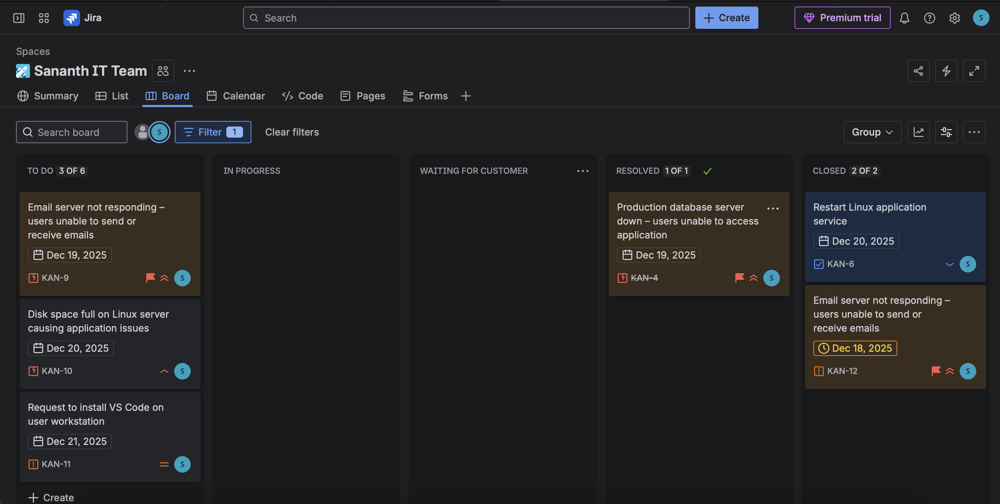
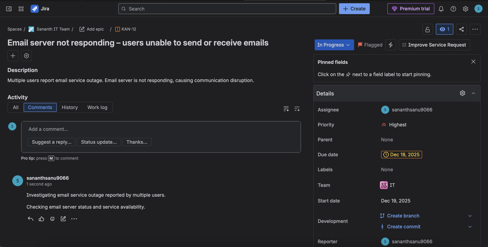
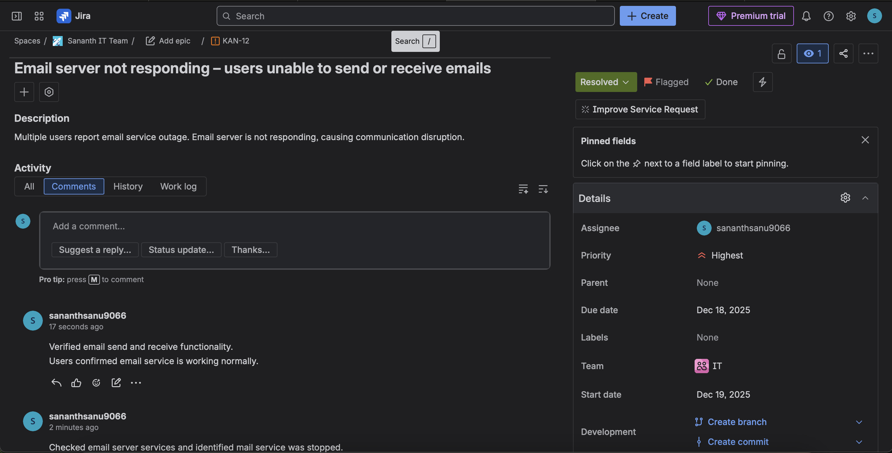
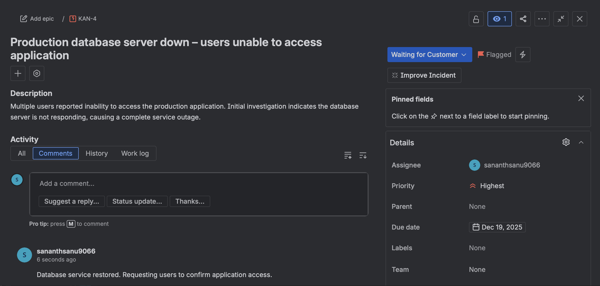
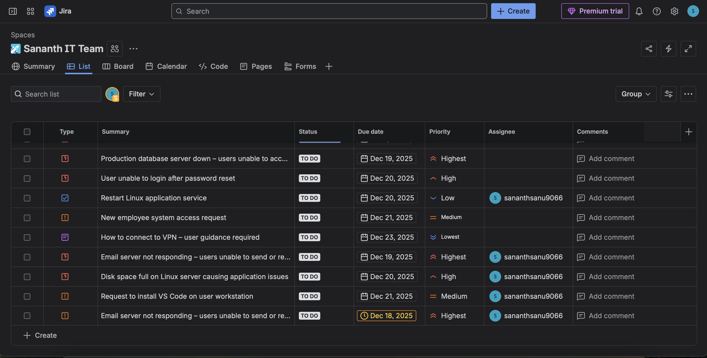

# IT Support Ticket Management – Jira Project

## 📌 Overview

This project is a **hands-on simulation of a real-world IT Support environment** using **Jira Service Management**. It demonstrates how incidents, service requests, tasks, and support tickets are handled following ITIL-aligned workflows.

The purpose of this project is to showcase practical understanding of IT support operations, Jira workflows, prioritization, documentation, and resolution processes.

---

## 🛠 Tools & Technologies

* **Jira Service Management (Cloud)**
* **GitHub** (project documentation & portfolio)
* **ITIL concepts** (Incident, Service Request, Task, Support)

---

## 🔄 Workflow Used

The following workflow was used throughout the project:

**To Do → In Progress → Waiting for Customer → Resolved**

Each ticket was handled according to its type and priority.

---

## 📂 Ticket Types Covered

* **Incident** – System outages and service disruptions
* **Service Request** – Software installation and access requests
* **Task** – Internal IT operational activities
* **Support** – User guidance and how-to assistance

---

## 🚨 Sample Tickets Implemented

### Critical Incidents

* Email server not responding – users unable to send or receive emails
* Production database server down – users unable to access application

### Other Scenarios

* Disk space full on Linux server causing application issues
* Restart Linux application service (internal task)
* Request to install VS Code on user workstation
* How to connect to VPN – user guidance required

---

## 📸 Project Screenshots

### Jira Board View

### Critical Incident – Email Server Outage

**In Progress**

**Resolved**

### Critical Incident – Database Server Down

**Waiting for Customer**

**Resolved**

### Task – Restart Linux Application Service

### Ticket List Overview

---

## 🧠 Key Learnings

* Jira ticket lifecycle management
* Incident prioritization and escalation
* Difference between Incident, Task, Service Request, and Support
* Importance of documentation and user communication
* SLA awareness and workflow discipline

---

## 📄 Project Documentation

Detailed project report is available here:

* **Project-Report.docx / Project-Report.md**

---

## 🧾 Resume Summary

Simulated IT Support operations using Jira Service Management by handling incidents, service requests, tasks, and support tickets with proper prioritization, documentation, and resolution workflows.

**Note:** This project is a hands-on simulation designed for learning and portfolio demonstration.
